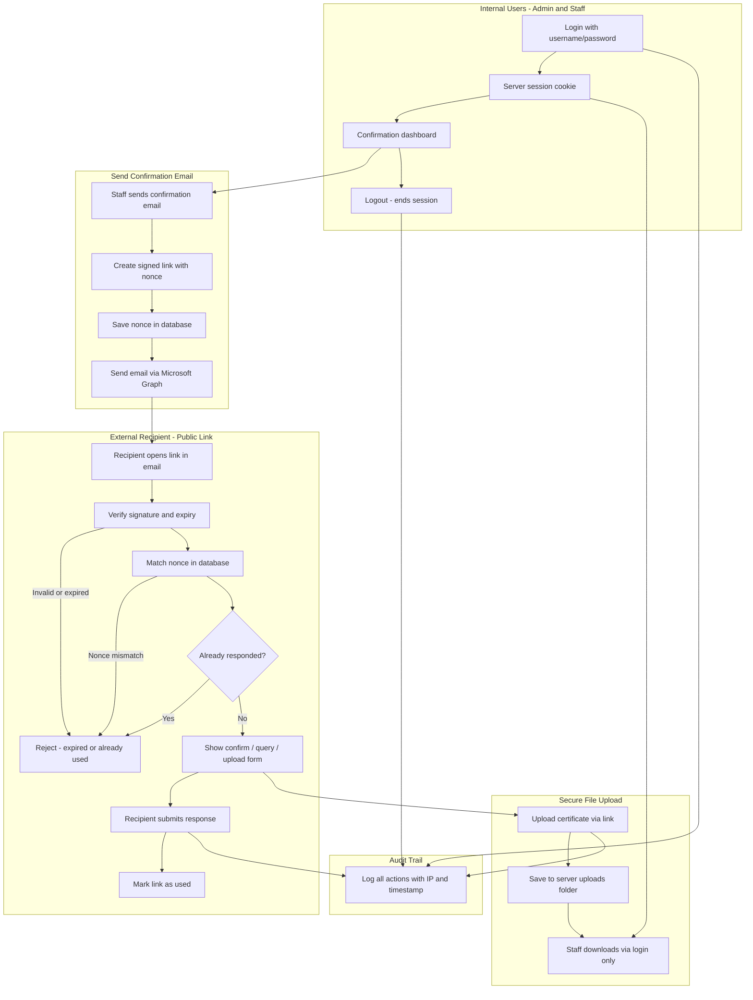
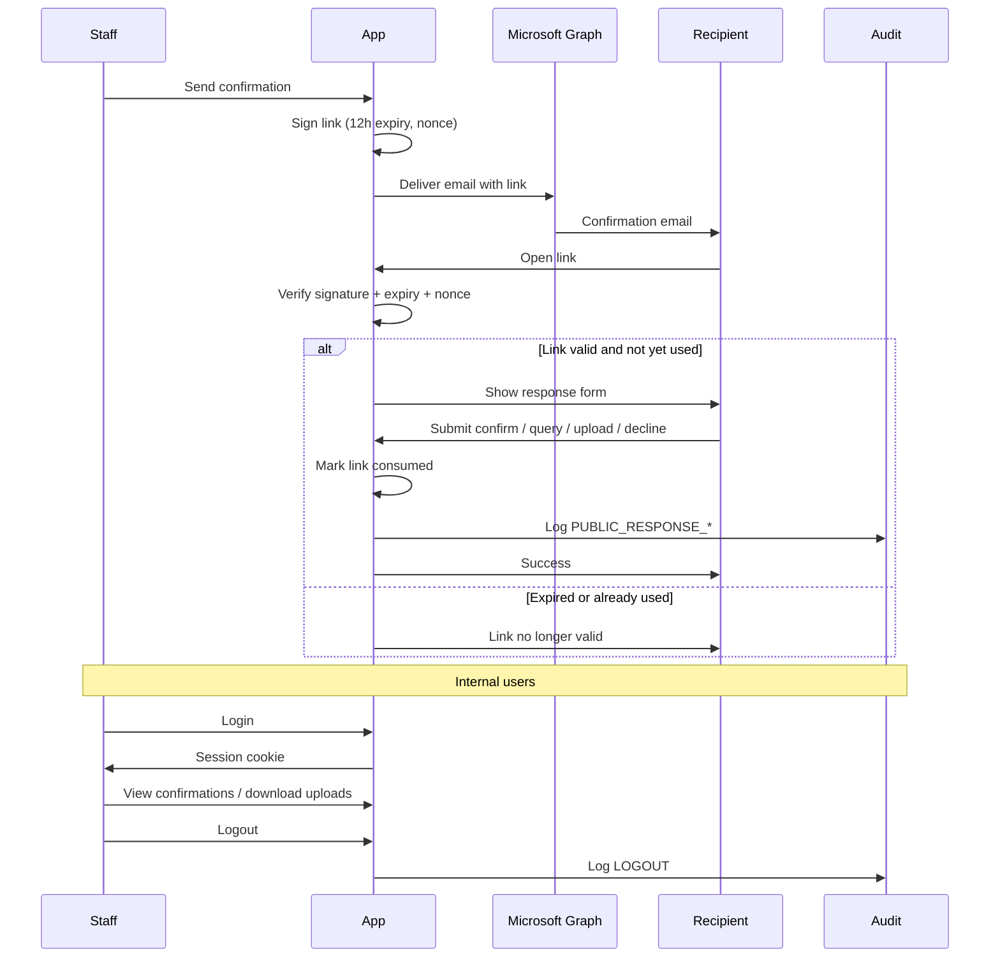

# Client Security Brief and Data Flow

## Gap to fix before sharing with client

You told the client links expire in **12 hours** and that this is **configurable via env**. Today that is **not true**:

- [`src/lib/email-action-jwt.ts`](src/lib/email-action-jwt.ts) hardcodes `const EXP = '90d'`
- [`src/lib/security-config.ts`](src/lib/security-config.ts) has no link-expiry setting

**Implementation (small change, ~3 files):**

1. Add `emailActionLinkExpiryHours: parseIntEnv('EMAIL_ACTION_LINK_EXPIRY_HOURS', 12)` to [`security-config.ts`](src/lib/security-config.ts)
2. Use it in [`email-action-jwt.ts`](src/lib/email-action-jwt.ts) — e.g. `.setExpirationTime(\`${hours}h\`)`
3. Document in [`docs/ENVIRONMENT.md`](docs/ENVIRONMENT.md) and [`env.ubuntu-server.example`](env.ubuntu-server.example)

"One-time access" already matches your choice: recipient can open the form until they submit; after submit the link is permanently invalid.

---

## Client brief (copy-ready)

### Public confirmation links

- **Signed, not guessable** — Each email contains a unique link signed with a server secret. Links cannot be forged or guessed.
- **Tied to one request** — The link is bound to a specific confirmation record and a one-time nonce. If a new email is sent, old links stop working.
- **Expires automatically** — Links stop working after **12 hours** (configurable via `EMAIL_ACTION_LINK_EXPIRY_HOURS` in server environment).
- **Single use on response** — Once the recipient confirms, queries, uploads, or declines, the link is consumed and cannot be used again.
- **No login required for recipients** — External parties only see the response page for their specific request. They cannot browse the rest of the application.
- **All public actions are logged** — Every link-based response is recorded in the audit trail with timestamp, IP, and action type.

### File upload from link (MSME)

- **Upload requires a valid link** — Files can only be uploaded through the signed link in the email; there is no open upload endpoint.
- **HTTPS only** — All traffic (including uploads) runs over a secure TLS connection in production.
- **Files are not publicly downloadable** — Uploaded files are stored on the server and are **not** exposed as public URLs. Only logged-in staff can download them through an authenticated session.
- **Safe file handling** — Filenames are sanitized; stored paths cannot escape the upload directory.

### Application access (admin and users)

- **Login required** — All internal pages and APIs require username/password authentication.
- **Role-based access** — Admins manage users and settings; regular users only access modules assigned to them.
- **Session security** — Sessions use secure, HTTP-only cookies; they expire after idle timeout (default 30 min) and max age (default 7 days).
- **Account lockout** — Repeated failed logins temporarily lock the account; persistent abuse requires admin password reset.
- **Logout for all users** — Both admin and regular users can log out from the sidebar. Logout immediately ends the server session, clears the cookie, and is written to the audit log.
- **Password change invalidates other sessions** — Changing password or admin reset ends all active sessions for that user.

### Infrastructure

- **Domain behind TLS** — The application sits behind a reverse proxy with HTTPS; session cookies are marked Secure.
- **Security headers** — Standard protections (CSP, X-Frame-Options, nosniff) on all responses.
- **Secrets in environment** — Signing keys and API secrets are never stored in code or the database.

---

## Visual data flow diagram

### Simpler sequence view (for slides)

---

## Key files (reference)

| Area | File |
|------|------|
| Link signing | [`src/lib/email-action-jwt.ts`](src/lib/email-action-jwt.ts) |
| Link verification | [`src/lib/public-confirmation-verify.ts`](src/lib/public-confirmation-verify.ts) |
| Public API routes | [`src/app/api/public/confirmation/`](src/app/api/public/confirmation/) |
| Upload download gate | [`src/app/api/uploads/local-file/route.ts`](src/app/api/uploads/local-file/route.ts) |
| Logout | [`src/app/api/auth/logout/route.ts`](src/app/api/auth/logout/route.ts) |
| Session policy | [`src/lib/security-config.ts`](src/lib/security-config.ts) |
| API protection | [`src/middleware.ts`](src/middleware.ts) |

---

## Recommended next step

Implement the 12-hour env config first, then share the brief and diagrams above with the client. Optionally add the brief as a short markdown doc under `docs/client-confirmation/` if you want it versioned in the repo.
